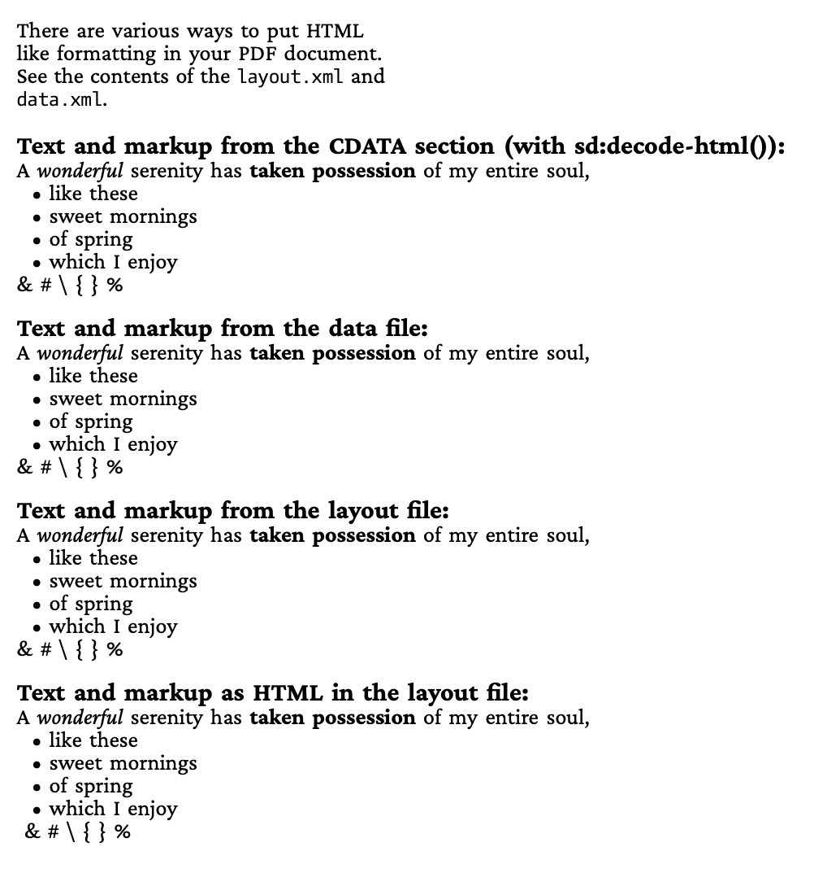
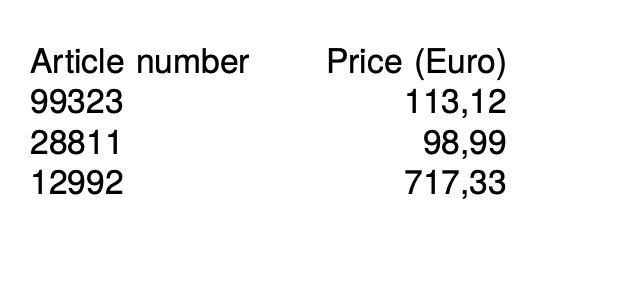
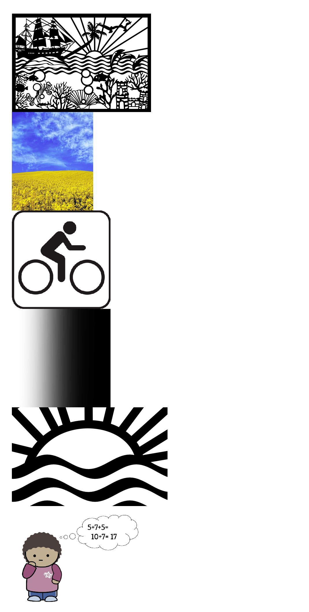
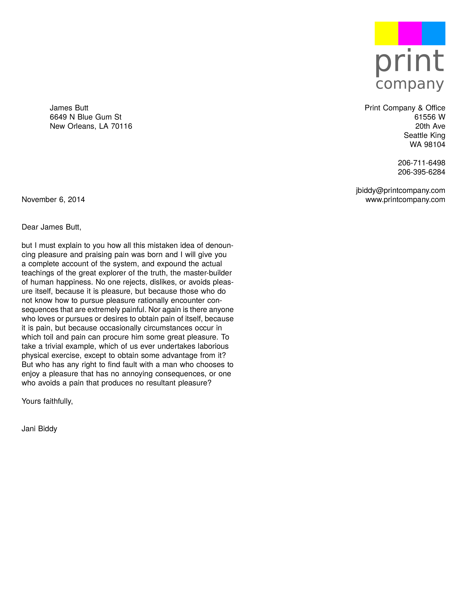
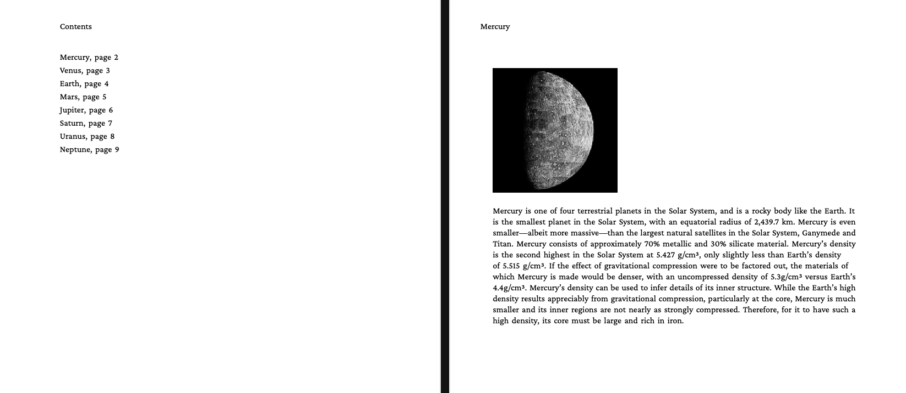
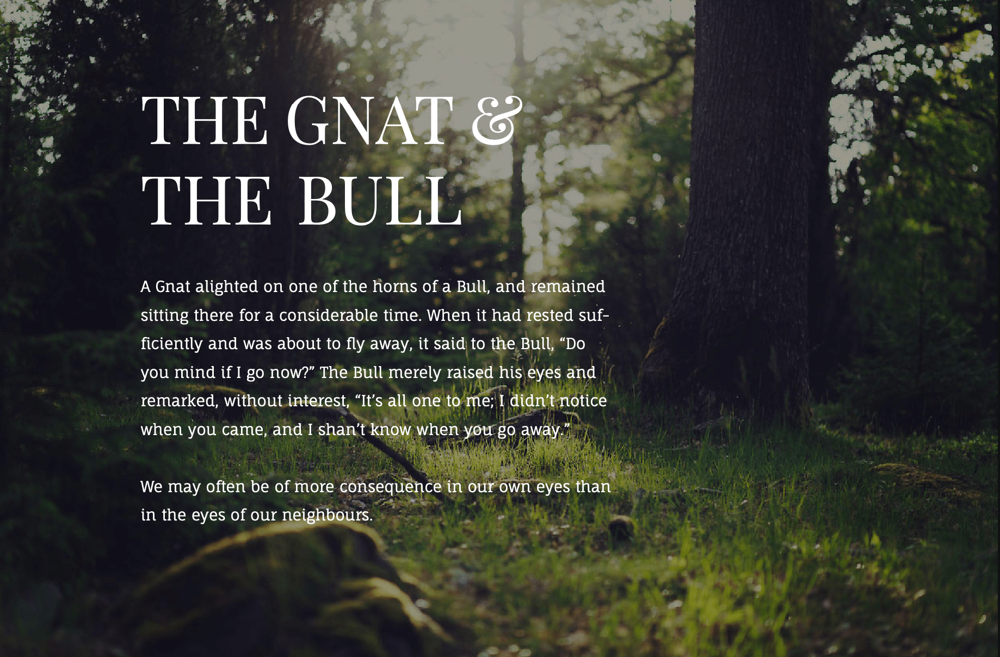

This repository contains examples for the [XTS XML typesetting system](https://github.com/speedata/xts), an OpenSource database publishing system (create a PDF from XML data).

Introductory examples are in the directory [introduction](introduction). More technical examples in the directory [technical](technical).

## Introduction

| Description | Preview |
| --- | --- |
| [Hello World](introduction/helloworld) — A minimal example that displays "Hello, world!" |  |
| [Data processing 1](introduction/dataprocessing1) — Barcodes with labels using ProcessNode to iterate child elements |  |
| [Data processing 2](introduction/dataprocessing2) — Same barcodes example using ForAll instead of ProcessNode |  |
| [Text formatting](introduction/textformatting) — Various text formatting: HTML, CDATA, markup in data, inline formatting |  |
| [Simple table](introduction/simpletable) — A simple table with article numbers and prices |  |
| [Images](introduction/images) — Including various image formats (PDF, JPG, PNG, GIF) and placeholder images |  |
| [Mail merge](introduction/mailmerge) — Personalized letters by merging recipient data with a template layout |  |
| [Planets](introduction/planets) — Multi-page document with table of contents, bookmarks, and internal links |  |

## Showcase

| Description | Preview |
| --- | --- |
| [The Gnat and the Bull](aesopgnatbull) — Aesop's fable with custom fonts and a full-page background image |  |

## Technical

| Description | Preview |
| --- | --- |
| [Base64 decode](technical/base64decode) — Decoding a base64-encoded image from the data XML and displaying it |  |
