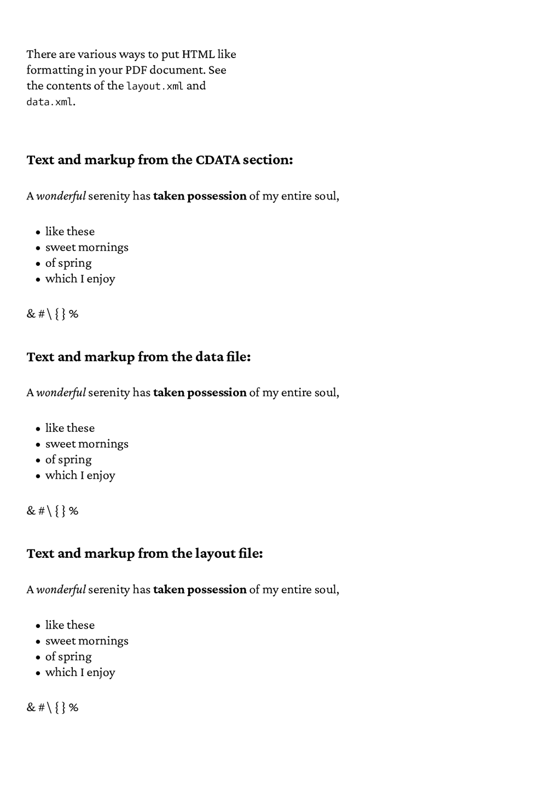

This repository contains examples for the [XTS XML typesetting system](https://github.com/speedata/xts), an open source database publishing system that creates PDF from XML data.

Every example is a directory with a `layout.xml`, usually a `data.xml`, and a `Readme.md` that says what the example shows and which commands to look at. `result.pdf` is the output of the current XTS release, `firstpage.png` a preview of its first page.

To run an example, install XTS from the [releases page](https://github.com/speedata/xts/releases/latest) and run `xts` inside the example directory. The result is `xts.pdf`. The [manual](https://doc.speedata.de/xts/) explains the commands.

## Introduction

Start here. The examples build on each other, from the first PDF to a multi-page document with a table of contents.

| Description | Preview |
| --- | --- |
| [Hello World](introduction/helloworld) -- Minimal layout: one Record, one TextBlock, one Value | <a href="introduction/helloworld"></a> |
| [Data processing 1](introduction/dataprocessing1) -- Barcodes per data element using Record and ProcessNode | <a href="introduction/dataprocessing1"></a> |
| [Data processing 2](introduction/dataprocessing2) -- The same barcodes using ForAll and sd:grid-width() | <a href="introduction/dataprocessing2"></a> |
| [Text formatting](introduction/textformatting) -- Four ways to get bold, italic and lists into text | <a href="introduction/textformatting"></a> |
| [Simple table](introduction/simpletable) -- Two column price table from data with CSS alignment | <a href="introduction/simpletable"></a> |
| [Images](introduction/images) -- PDF, JPEG, PNG, placeholder and missing image handling | <a href="introduction/images"></a> |
| [Mail merge](introduction/mailmerge) -- One form letter per record with master page and areas | <a href="introduction/mailmerge"></a> |
| [Planets](introduction/planets) -- Two-run booklet with table of contents, bookmarks and links | <a href="introduction/planets"></a> |

## Showcase

| Description | Preview |
| --- | --- |
| [The Gnat and the Bull](aesopgnatbull) -- Fable on a full-bleed photo with embedded fonts and CSS | <a href="aesopgnatbull"></a> |

## Technical

| Description | Preview |
| --- | --- |
| [Base64 decode](technical/base64decode) -- Image from base64 data via sd:decode-base64 and sd:file-contents | <a href="technical/base64decode"></a> |
| [ZUGFeRD invoice](technical/zugferd) -- PDF/A-3b invoice with the embedded Factur-X XML | <a href="technical/zugferd"></a> |

## Checking the examples

Every example is run and compared against its `result.pdf` on each push, see the [workflow](.github/workflows/check.yml). To do the same locally you need XTS and Rake; ImageMagick and Ghostscript are only used when a PDF differs:

```
rake qa
```

Every example is run with `--suppressinfo`, which makes the PDF reproducible, and the result is compared with `result.pdf` by hash. Only when the bytes differ, which a newer XTS can cause without a visible change, `xts compare` renders both PDFs and compares the pages. A visible difference produces `pagediff-NN.png` files in the example directory and a `compare-report.html`. `rake qa[introduction/planets]` checks one example, `XTS=path/to/xts rake qa` uses another binary than the one in `PATH`.

After changing an example, `rake regenerateqa[introduction/planets]` writes its new `result.pdf` and `firstpage.png`; without the argument it regenerates all of them. `rake clean` removes the files a run leaves behind.
