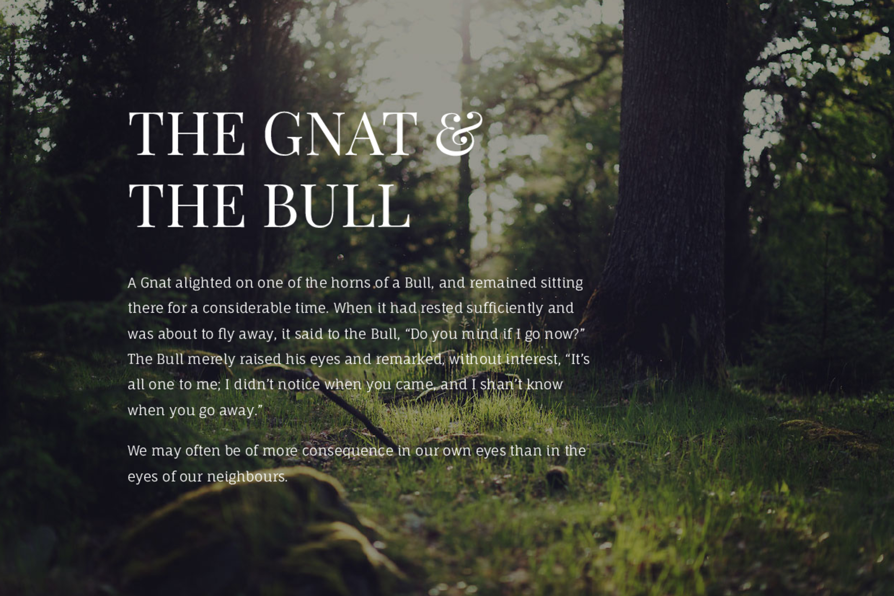

# Aesop: The Gnat and the Bull

This example typesets a short Aesop fable as a single landscape page (210mm by 140mm) with a full-bleed forest photograph as the background and white text on top. It shows how to combine a CSS stylesheet with embedded fonts, a master page that places a background image, and a small data file that provides the title and the paragraphs of the story.

## What to look at

- `<StyleSheet>` with two `@font-face` rules loads `fonts/FaunaOne-Regular.ttf` and `fonts/PlayfairDisplay-Regular.ttf` and defines the `p` and `.heading` styles (white text, font sizes, line heights, margins).
- `<PageFormat width="210mm" height="140mm" />` sets the landscape page size.
- `<DefineMasterPage name="first" test="sd:current-page() = 1" margin="1cm">` applies only to the first page. Its `<AtPageCreation>` places `img/forest.jpg` at `column="-2mm" row="-2mm"` with `width="214mm"`, so the image runs slightly beyond the page edges.
- `<Record match="data">` places the title with `<Value select="upper-case(story/@title)" />` in a `<Paragraph class="heading">`.
- `<ForAll select="story/p">` creates one `<Paragraph>` per `p` element of the story.
- `<TextBlock width="10">` and `<TextBlock width="11">` use grid units for the width, `<PlaceObject row="2" column="3">` uses grid coordinates.

## Run

Run `xts` in this directory. The result is `xts.pdf`; `result.pdf` is the expected output for comparison.

The design is inspired by [femmebot/google-type](https://femmebot.github.io/google-type/#femmebot). The material in the repository at <https://github.com/femmebot/google-type> is believed to be under a liberal license. If not, please tell me.
