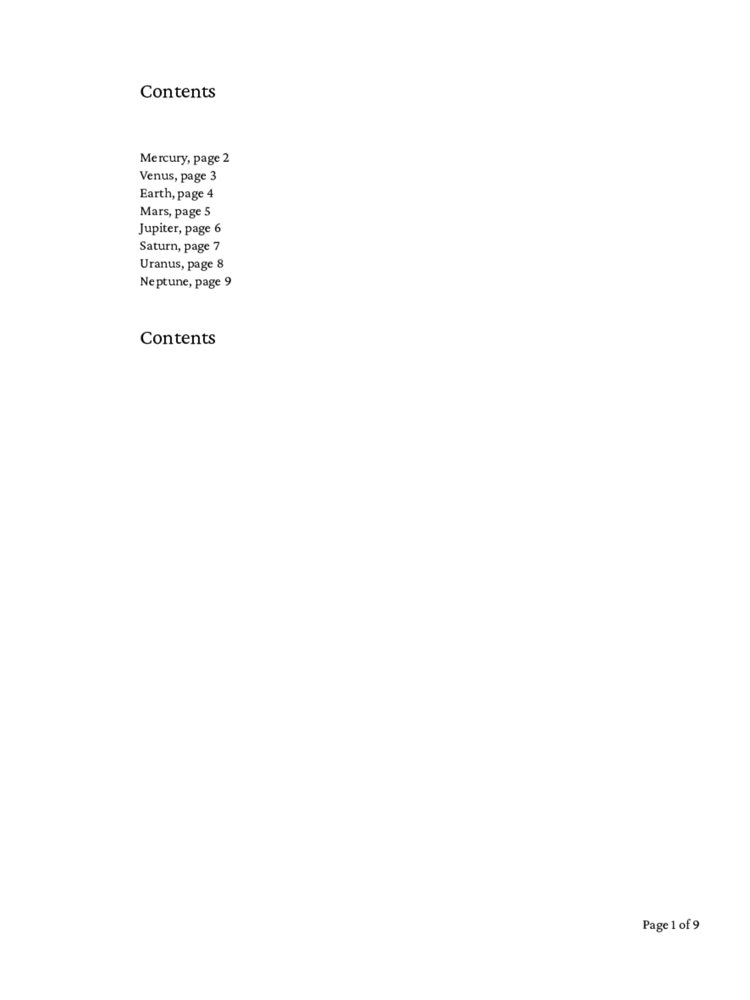

# Planets

This example typesets a small booklet about the eight planets, one planet per page with name, image, list of moons and description, preceded by a table of contents with page numbers and links. It shows two-pass processing (the page numbers are collected in the first run and read back in the second), left and right master pages with a page footer, PDF bookmarks and internal links.

## What to look at

- `<DefineMasterPage name="right page" test="sd:odd( sd:current-page() )" ...>` and `<DefineMasterPage name="left page" test="sd:even( sd:current-page() )" ...>` use different margins for odd and even pages. Their `<AtPageShipout>` places a `Page x of y` footer at `row="{ sd:number-of-rows() - 1}"` using `sd:current-page()` and `sd:last-page-number()`.
- `<LoadXML name="toc"/>` in `<Record match="planets">` reads the file `xts-toc.xml` if it exists and dispatches to `<Record match="tableofcontents">`, which prints the contents with `<A link="{@name}">` links. In the first run the file does not exist yet, so no table of contents is printed.
- `<SetVariable variable="contents">` in `<Record match="planet">` appends an `<Element name="planetlisting">` with `<Attribute name="name">` and `<Attribute name="pagenumber" select=" sd:current-page()">` to the variable; `<SaveXML name="toc" elementname="tableofcontents" select="$contents" />` writes it to `xts-toc.xml` at the end.
- `<Bookmark level="1" select="@name" open="yes"/>` creates a PDF bookmark per planet, `<Mark select="@name" pdftarget="yes" />` inside `<Action>` creates the link target used by the table of contents.
- `<ProcessNode select="image" />`, `moons` and `description` dispatch to their own `<Record>` elements; `<Record match="image">` loads `images-rgb/{.}`, `<Record match="moons">` builds a `<Ul>` with `<ForAll select="moon">`.
- `<SetVariable variable="column" select="2" />` defines a variable used as `column="{ $column }"` in several `<PlaceObject>` elements.

## Run

Run `xts` in this directory. The result is `xts.pdf`; `result.pdf` is the expected output for comparison.

`xts.cfg` sets `runs = 2`, so xts processes the layout twice. The first run writes `xts-toc.xml` with the page numbers, the second run reads it and prints the table of contents.

