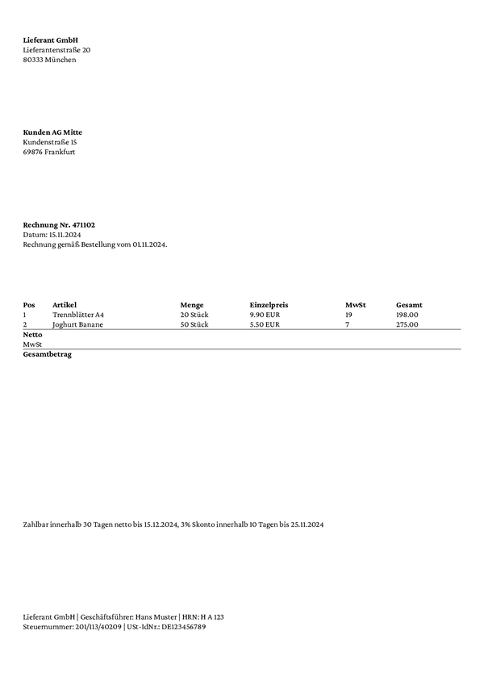

# ZUGFeRD invoice

This example produces a German invoice as a PDF/A-3b file with the
machine readable invoice data embedded as `factur-x.xml`. That is the
ZUGFeRD (Factur-X) format that accounting software can read without
OCR. The visible invoice is built from the same `data.xml` with a
header, addresses, an item table and the totals.

## What to look at

- `xts.cfg` sets `pdfa="3b"`. PDF/A-3 is the only PDF/A part that allows
  embedded files, and ZUGFeRD requires it.
- `<AttachFile href="zugferd.xml" name="factur-x.xml" type="facturx">`
  embeds the invoice XML under the file name the ZUGFeRD standard
  expects and adds the Factur-X metadata to the PDF. XTS reads the
  profile from the XML.
- `<PDFOptions displaymode="attachments">` opens the PDF with the
  attachment pane visible, so a reader sees the embedded file.
- `<Table stretch="max">` with `<TableHead>` for the item table; the
  columns for quantity, unit price and total are right aligned.
- The seller and buyer addresses are plain `<Paragraph>` blocks with
  ` ` between the lines.

## Run

Run `xts` in this directory. The result is `xts.pdf`; `result.pdf` is
the expected output for comparison. `zugferd.xml` is the embedded
invoice, it is not read by the layout.

